# Project Flexbox/Grid page layout

### This Repo is based on:

- tutorial within [Frontendmasters' Beginners Path](https://frontendmasters.com/learn/beginner/)
- tutorial [GitHub](https://github.com/jen4web/fem-layout)
- tutorial video [Flexbox and CSS Grid exercise](https://frontendmasters.com/courses/css-grids-flexbox/flexbox-and-css-grid-exercise-2-setup/)
- tutorial video [Flexbox and CSS Grid solution](https://frontendmasters.com/courses/css-grids-flexbox/flexbox-and-css-grid-exercise-2-solution/)

### What is this about?

### Based on Project "Pie Flexbox" (see link below) - refactor to Flexbox and CSS Grid

- take already coded exercise ["Pie Flexbox"](https://github.com/ElkeHanschen/project-flexbox-page-layout) and follow tasks below
- tasks:
  - figure out when to keep flexbox and when to try CSS Grid
  - change Gallery page, Home page and History page accordingly
  - optional: add also the [remaining pages, for this find content here](https://github.com/jen4web/fem-layout/tree/master/day-2-grid/18-practice)

#### My breakpoints (different from course ones)

- 320px
- 640px
- 880px

### Screenshots of tutorial results - to (vagely) stick to styling

- I adapted/styled differently what I did not like
- click following links

[Tutorial Home Page](#tutorial-home-page)

[Tutorial Pie Gallery](#tutorial-pie-gallery)

[Tutorial History Page](#tutorial-history-page)

### How to run this?

- clone this repo
- `cd` into project
- open `index.html` in your browser of choice (in my case, built in/for Chrome)

#### Tutorial Home Page

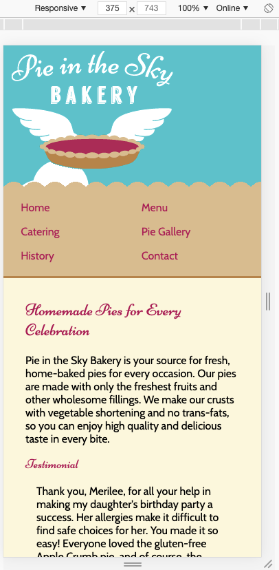
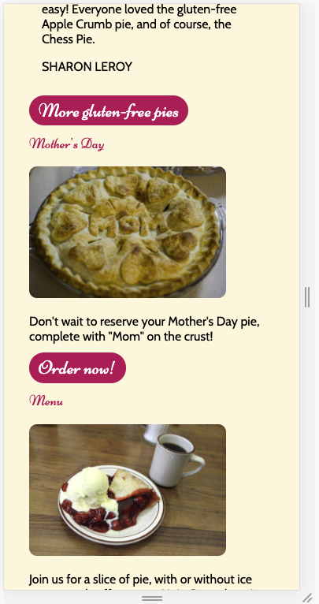
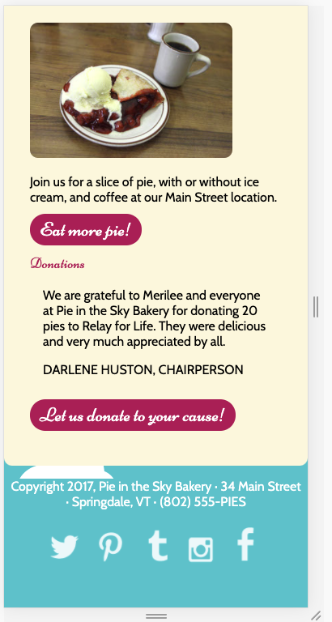

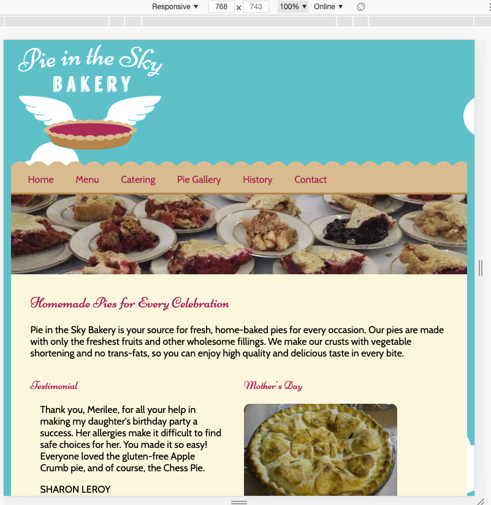
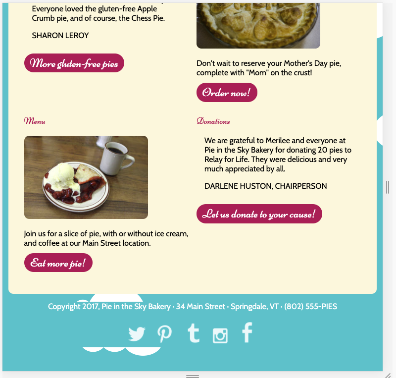

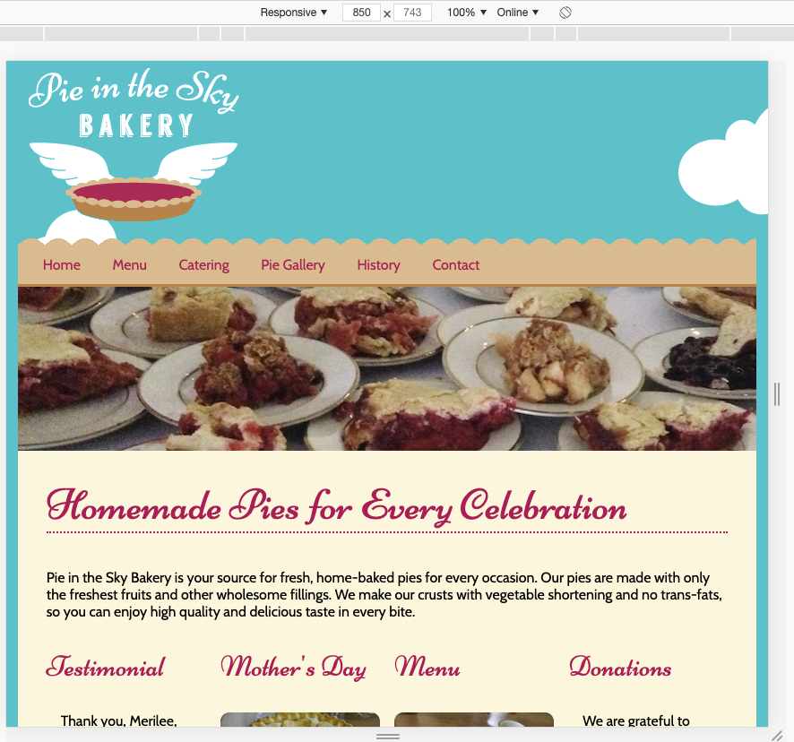
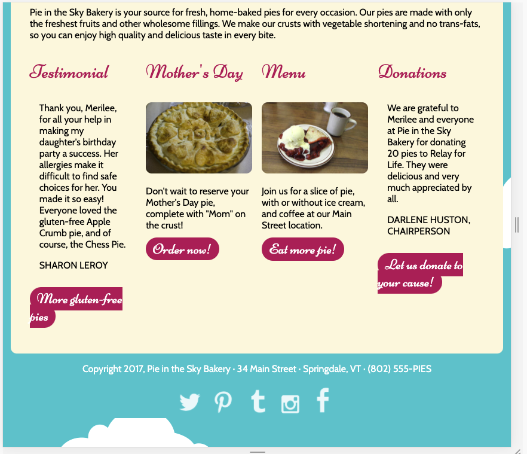

#### Tutorial Pie Gallery

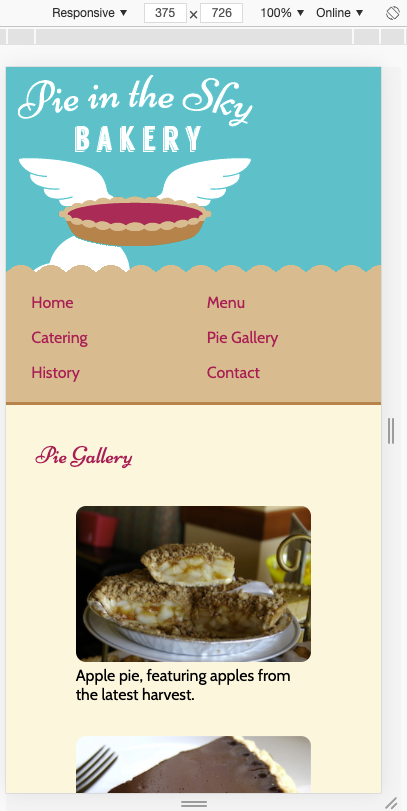
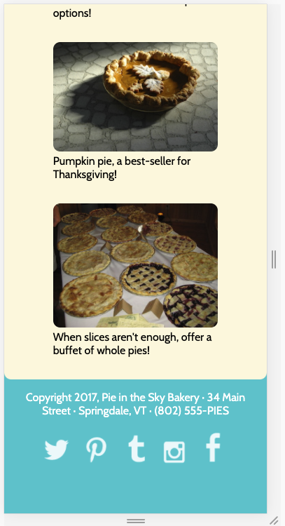

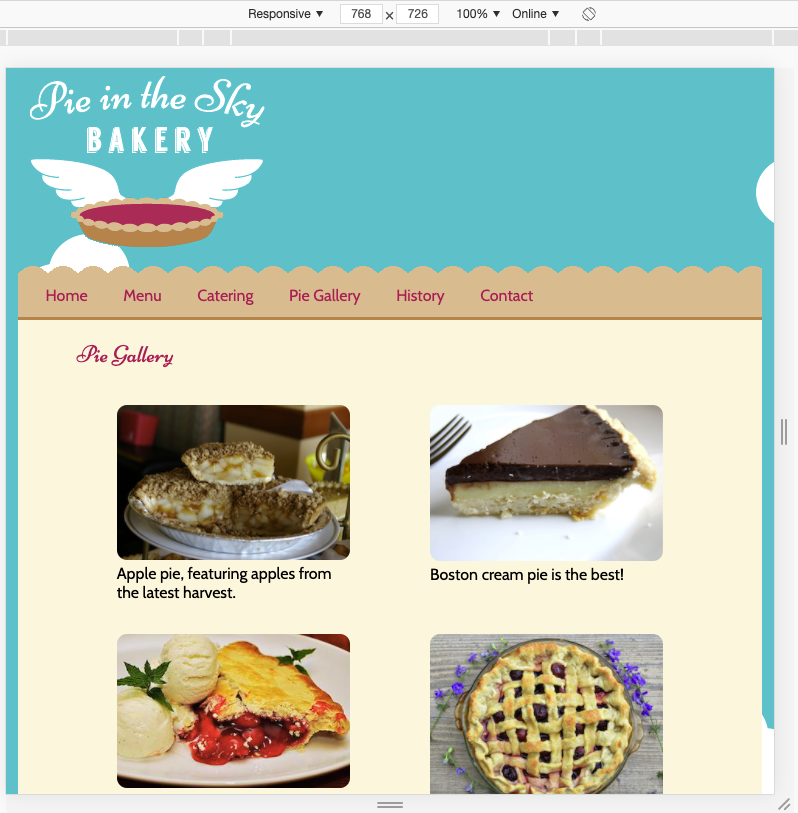
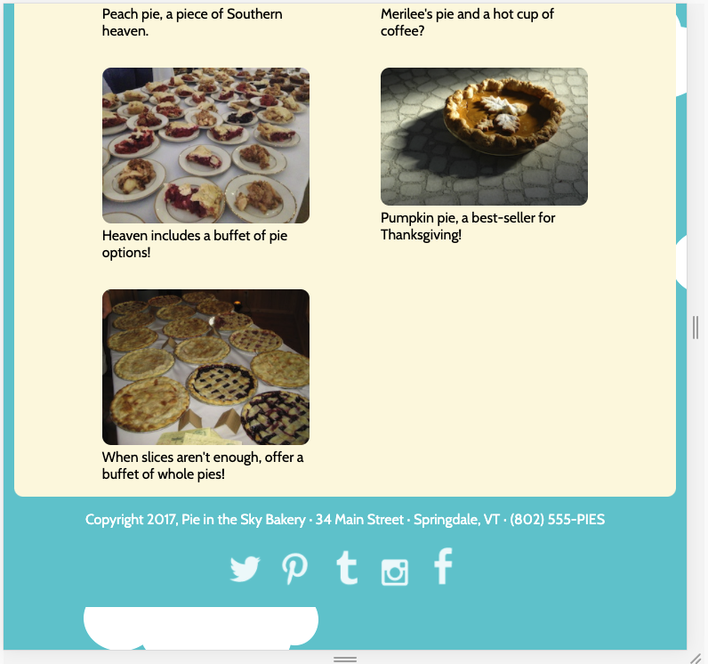

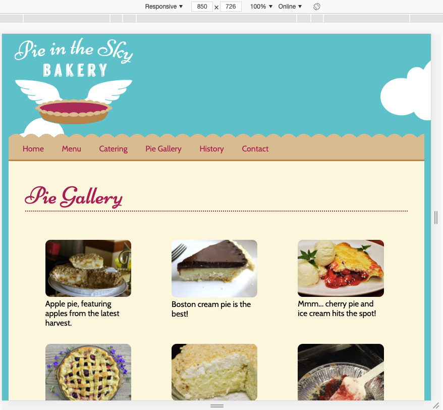
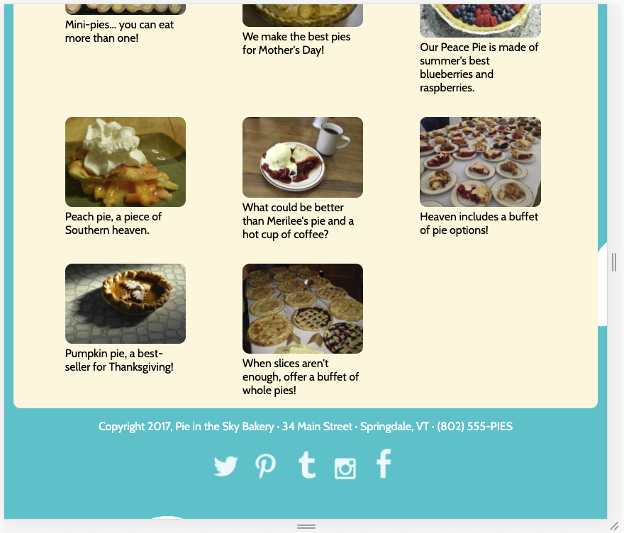

#### Tutorial History Page

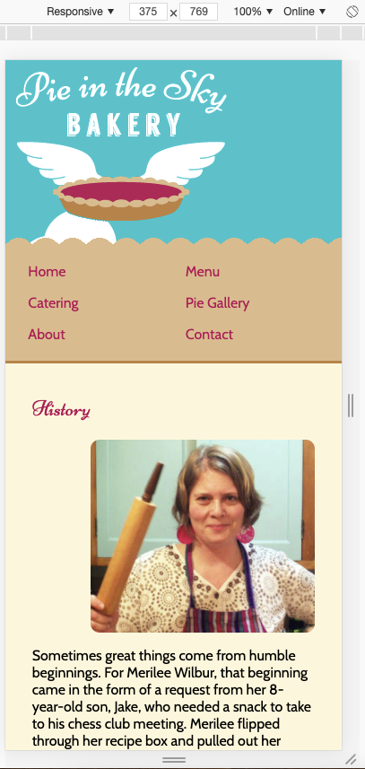
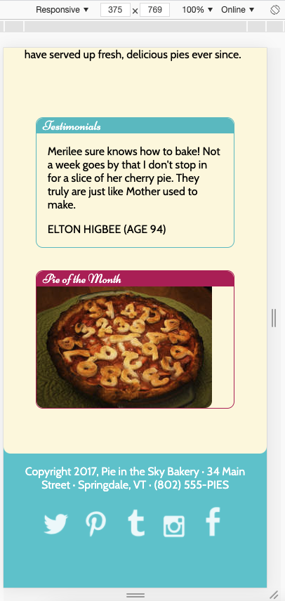

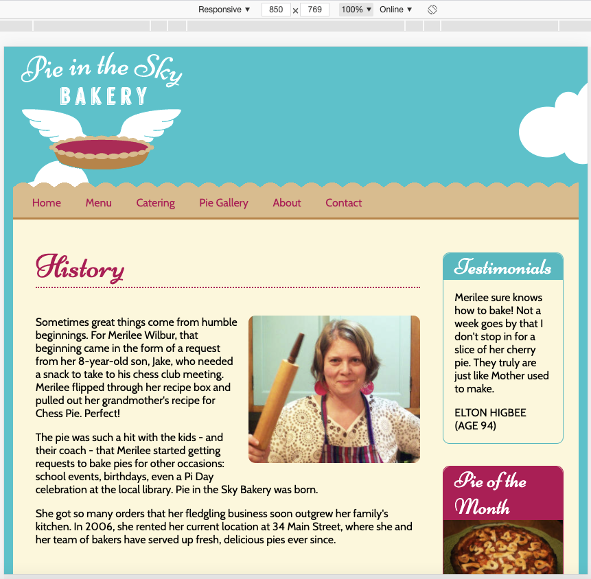

